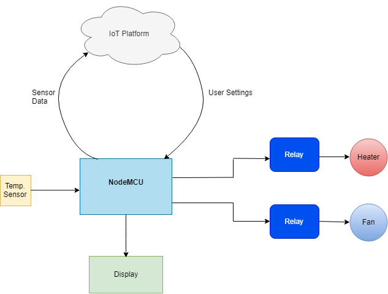

# esp8266-temperature-control
This project uses the ESP8266 WiFi microcontroller to implement a temperature monitoring and control system.
A DHT-11 temperature + humidity sensor is used to monitor temperature conditions in an environment.
Depending on the current conditions, a fan or heater will be switched on to maintain the desired temperature setpoint.
Temperature/setpoint data is displayed locally on an OLED dispay as well as being sent to a cloud-based dashboard (Ubidots) over MQTT where it can be monitored remotely.
The cloud dashboard also allows users to remotely change the desired setpoint and switch the fan or heater on/off manually. 

System block diagram:
